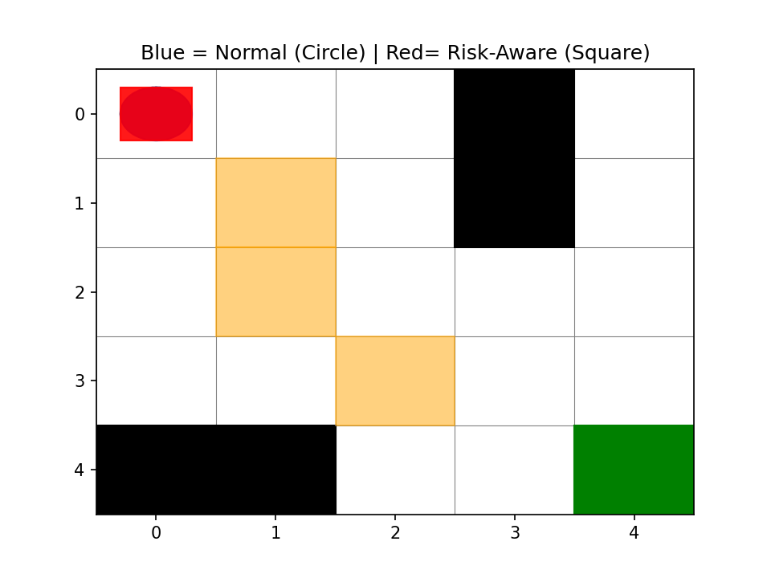
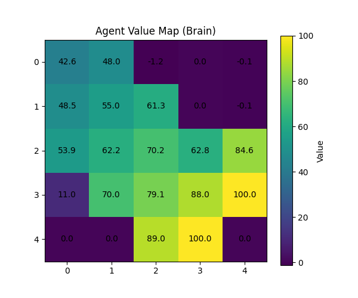

#Risk-Aware Reinforcement Learning for Robot Navigation

## Overview

This project implements a **Q-learning based navigation system** where an agent learns to reach a goal while avoiding risky regions.

Unlike traditional shortest-path planning, the agent learns behavior through **reward-based learning**.


## Key Idea

Two agents are trained:

* 🔵 **Normal Agent** → prioritizes shortest path
* 🟥 **Risk-Aware Agent** → avoids high-risk areas

This demonstrates how **reward design changes behavior**


## Environment

* Grid world (5×5)
* Obstacles → blocked cells
* Risk zones → allowed but penalized
* Goal → high reward

## Results

### Agent Comparison (Animation)


Normal Path: [(0, 0), (1, 0), (1, 1), (2, 1), (2, 2), (3, 2), (4, 2), (4, 3), (4, 4)]

Risk-Aware Path: [(0, 0), (0, 1), (0, 2), (1, 2), (2, 2), (2, 3), (2, 4), (3, 4), (4, 4)]

### Value Map (Agent “Brain”)


[ 42.612659    48.00364148  -1.2168615    0.          -0.1       ]
 [ 48.45851     54.9539      61.33313177   0.          -0.1       ]
 [ 53.89210738  62.171       70.19        62.80695314  84.5595347 ]
 [ 11.03250343  69.99635852  79.1         87.98287888  99.9870993 ]
 [  0.           0.          89.         100.           0.        ]

## Key Observations

* Normal agent takes shorter path, even through risky zones
* Risk-aware agent chooses safer but longer path
* Learned policy generalizes to new environments


##  Generalization-
[(0, 0), (1, 0), (2, 0), (3, 0), (4, 0), (3, 0), (2, 0), (1, 0), (0, 0), (1, 0), (2, 0), (3, 0), (4, 0), (4, 1), (3, 1), (2, 1), (3, 1), (4, 1), (4, 0), (3, 0), (2, 0), (1, 0), (0, 0), (1, 0), (2, 0), (3, 0), (4, 0), (3, 0), (2, 0), (1, 0), (0, 0), (0, 1), (0, 2), (1, 2), (0, 2), (0, 3), (0, 4), (1, 4), (2, 4), (3, 4), (4, 4)]
The trained agent is tested on a **new unseen environment**, showing:

* adaptation to new obstacles
* non-memorized behavior


##  Tech Stack

* Python
* NumPy
* Matplotlib


## ▶️ How to Run

```bash
python -m pip install numpy matplotlib imageio
python main.py
```

##  Key Insight

> Reward shaping directly influences decision-making in reinforcement learning systems.

##  Future Improvements

* Larger grid environments
* Dynamic obstacles
* Deep Reinforcement Learning (DQN)
Risk-Aware Reinforcement Learning for Robot Navigation

Key Insight
Reward shaping directly influences decision-making in reinforcement learning systems.

Future Improvements
Larger grid environments
Dynamic obstacles
Deep Reinforcement Learning (DQN)
